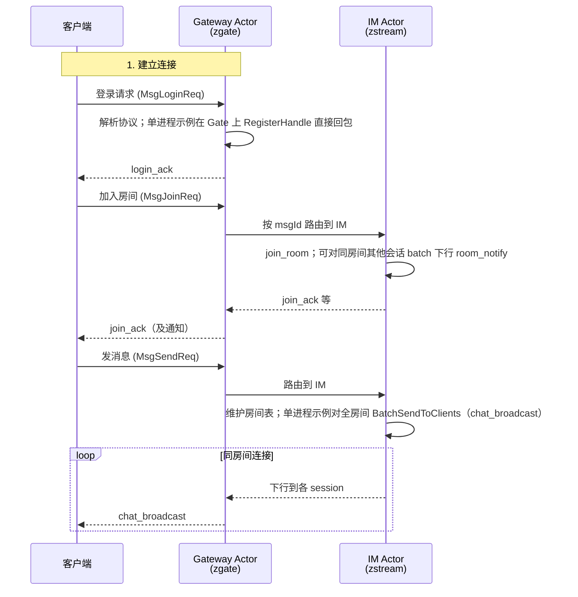

# 7.1 需求分析与架构设计

第七章以仓库 `zhenyi/examples/im_*` 为主线：本节做需求与架构；7.2 单进程服务端；7.3 客户端；7.4 多进程 Gate/IM；7.5 压测与调参。要把 IM 跑稳、可观测并对齐生产习惯，建议与第 6 章并读（6.1 日志/指标/追踪集成、6.2 Prometheus、6.3 链路追踪、6.4 部署）。若要在网关、编解码或扩展点上做定制，可接着读第 8 章（8.1 自定义协议与扩展开发，8.2 社区参与）。

在开始写代码之前，我们先梳理一下 IM 系统的需求和整体架构。这一步看似简单，却非常重要——架构设计决定了后续的开发难易程度和系统上限。

## 7.1.1 需求分析

我们需要实现一个最简单的 IM 系统，包含以下核心功能：

### 用户登录

用户连接服务器后，需要进行登录认证。登录时客户端传入 `userId`，服务器响应 `login_ack`。为了简化实现，本示例暂不维护 `sessionId` 与 `userId` 的持久化绑定。

### 加入房间

用户可以加入指定房间（默认为 `lobby` 大厅）。同一房间的用户可以看到彼此发送的消息。

### 离开房间

用户可以主动离开房间，或者断开连接后自动离开。

### 发送消息

用户在房间内发送消息，同一房间的所有用户都能收到。

### 消息协议定义

为了简化实现，我们使用 JSON 作为消息序列化格式。协议格式如下：

```json
// 登录请求
{
    "userId": 12345
}

// 加入房间请求
{
    "room": "lobby",
    "nickname": "Alice"
}

// 发送消息请求
{
    "room": "lobby",
    "text": "Hello everyone!"
}
```

对应的响应格式：

```json
// 登录响应（sessionId 为运行时连接/通道 ID，由框架分配，与 userId 无固定相等关系）
{
    "ok": true,
    "type": "login_ack",
    "sessionId": 1,
    "userId": 12345
}

// 加入房间响应
{
    "ok": true,
    "type": "join_ack",
    "sessionId": 1,
    "room": "lobby",
    "nickname": "Alice"
}

// 房间内广播（仓库 examples/im_single_demo：type 为 chat_broadcast，另含 SM3 摘要字段 sign）
{
    "type": "chat_broadcast",
    "room": "lobby",
    "fromSessionId": 1,
    "nickname": "Alice",
    "text": "Hello everyone!",
    "sign": "..."
}
```

消息 ID 定义：

| 消息 ID | 名称 | 方向 | 说明 |
|---------|------|------|------|
| 1 | MsgLoginReq | C → S | 登录请求 |
| 2 | MsgJoinReq | C → S | 加入房间请求 |
| 3 | MsgLeaveReq | C → S | 离开房间请求 |
| 4 | MsgSendReq | C → S | 发送消息请求 |

## 7.1.2 整体架构设计

IM 系统的整体架构如下：

```text
┌─────────────┐         ┌─────────────┐         ┌─────────────┐
│   Client A  │         │   Client B  │         │   Client C  │
└──────┬──────┘         └──────┬──────┘         └──────┬──────┘
       │                       │                       │
       │     TCP / WS / KCP    │                       │
       └───────────────────────┼───────────────────────┘
                               │
                       ┌───────┴───────┐
                       │   zgate       │
                       │  (Gateway)    │
                       └───────┬───────┘
                               │
                       ┌───────┴───────┐
                       │  zstream      │
                       │  (IM Actor)   │
                       └───────────────┘
```

### 核心组件

| 组件 | 职责 | 对应模块 |
|------|------|----------|
| Gateway | 连接管理、协议解析、消息路由 | zgate |
| IM Actor | 业务逻辑、房间管理、消息广播 | zstream |
| App | 统一启动入口、Actor 注册 | zstartup |

> **注意**：本示例为最小实现，未维护 SessionId 与 userId 的绑定。如需支持私聊等功能，可在登录时调用 `channel.SetAuthId()` 建立绑定。



### 消息流向

1. **客户端 → Gateway**：客户端发送带 msgId 的线协议帧，Gateway 解析后得到 `*zmsg.Message`（其中 `SessionId` 标识该 TCP 连接对应的会话通道，不是业务侧的 userId）。
2. **Gateway → IM Actor**：除 Gate 本地 `RegisterHandle` 截获的 msgId（单进程示例里只有登录）外，其余业务 msgId 由框架按 Actor 分组与发现信息投递到 IM；**路由键是 msgId（及多进程下的目标 Actor），不是「把 SessionId 映射成某个 actorId」这种手写表**。
3. **IM Actor 处理**：IM 维护房间与成员，处理加入/离开/广播等。
4. **IM → Gateway → 客户端**：IM 通过 `SendToClient` / `BatchSendToClients` 等 API 指定回包目标会话，Gate 负责写回对应连接。

多进程版 Gate 在登录路径上可额外发起 `CallActor` 演示 RPC（见 7.4），与上述「业务上行仍按 msgId 进 IM」并行存在。

## 7.1.3 Actor 设计

本系统使用两个 Actor：

### Gateway Actor

- **ActorType**：`1`
- **职责**：
  - 管理客户端连接
  - 解析线协议并构造 `*zmsg.Message`
  - 将非本地处理的 msgId 转交给 Group/路由层，投递到 IM 等业务 Actor
  - 根据业务 Actor 的回包指令，把字节流写回正确的连接（框架在消息上下文里携带 `SessionId`、源 Gate Actor 等信息）
- **单进程示例中 Gate 显式 `RegisterHandle` 的 msgId**：仅 `MsgLoginReq`（见 `examples/im_single_demo/main.go`）。加入房间、发消息等在 IM 上注册。

> **说明**：不要把 `SessionId` 理解成「等价于 userId」。本示例未持久化 `SessionId ↔ userId`；需要私聊或审计时可在登录成功后自行调用通道 API（如 `channel.SetAuthId`）建立绑定。

### IM Actor

- **ActorType**：`2`
- **职责**：
  - 维护房间状态（session → room 映射）
  - 维护房间成员列表（room → session 集合）
  - 处理加入/离开房间、发送消息的业务逻辑
- **处理的 msgId**：`MsgJoinReq`、`MsgLeaveReq`、`MsgSendReq`

### 为什么这样设计？

很多新手可能会问：为什么不把 Gateway 和 IM 合并成一个 Actor？

答案是：**职责分离**。

- Gateway 专注于连接管理和协议解析，这一层的变化较频繁
- IM Actor 专注于业务逻辑，这一层相对稳定

分离之后，如果未来需要更换协议（比如从 JSON 换成 protobuf），只需要修改 Gateway，不需要动 IM Actor。

## 7.1.4 本节要点

1. **需求**：登录、加入房间、离开房间、房间内广播（仓库实现含 `room_notify`、`chat_broadcast` 与批量下行，见 7.2 与 `examples/im_single_demo`）。
2. **架构**：Gateway（连接与协议）与 IM（房间状态与业务）分离。
3. **协议**：示例以 JSON payload 为主；观测与指标可与 **第 6 章** 的 Prometheus 抓取配合。

下一节从 `examples/im_single_demo` 源码出发实现单进程版本。
