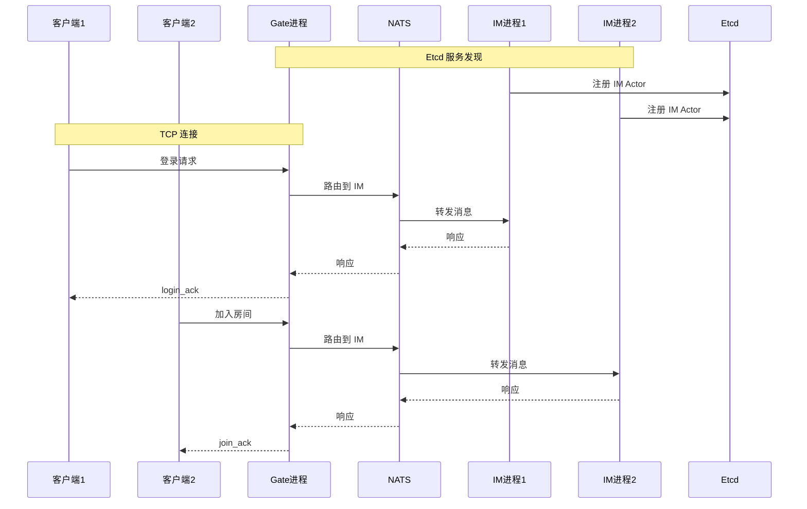

# 7.4 多进程分布式 IM 实现

单进程版本只能运行在一个进程中，无法水平扩展。本节我们将把它改造成多进程版本：

- **Gate 进程**：负责连接管理、协议解析、消息路由
- **IM 进程**：负责业务逻辑

两个进程通过 **NATS** 进行跨进程通信，通过 **Etcd** 进行服务发现。

## 7.4.1 多进程架构



## 7.4.2 进程划分

| 进程 | Actor | 职责 |
|------|-------|------|
| Gate 进程 | Gateway Actor | 连接管理、协议解析、路由 |
| IM 进程 | IM Actor | 业务逻辑、房间管理 |

定义进程 ID：

```go
const (
    ProcessGate uint = 1
    ProcessIM   uint = 2
)
```

定义 Actor ID（多进程下需要固定）：

```go
const (
    GateActorID uint64 = 101
    IMActorID   uint64 = 201
)
```

## 7.4.3 初始化 NATS 和 Etcd

```go
// 初始化 NATS
znats.NewDefaultNats(*natsURL, 1)
if err := znats.DefaultNatsClient.Connect(ctx); err != nil {
    panic(err)
}

// 初始化 Etcd
etcdCli, err := clientv3.New(clientv3.Config{
    Endpoints: []string{*etcdEP},
})
if err != nil {
    panic(err)
}
defer etcdCli.Close()

// 创建服务发现
discoverer, err := zdiscovery.NewEtcdDiscovery(ctx, etcdCli)
if err != nil {
    panic(err)
}
defer discoverer.CloseAll()
```

## 7.4.4 App 配置

```go
app := zstartup.NewApp(ctx, zstartup.AppConfig{
    Process:  *process,   // 通过命令行参数指定
    IsSingle: false,      // 非单机模式，开启服务发现
    ConnType: 1,          // 仓库 im_multi_demo 当前字面量为 1，与 znet.TCP 等价；新代码可写 znet.TCP
    Actors:   buildActors(*process, *addr),
})

// 设置服务发现
app.Group.SetDiscoverer(discoverer)
```

关键区别：**`IsSingle: false`**。这告诉 zhenyi 开启服务发现和跨进程路由。

## 7.4.5 进程启动函数

根据进程 ID 决定启动哪些 Actor：

```go
func buildActors(process uint, gateAddr string) []zmodel.ActorConfig {
    switch process {
    case ProcessGate:
        return []zmodel.ActorConfig{
            {
                Id:        GateActorID,
                ActorType: ActorTypeGate,
                Name:      "gate",
                Index:     1,
                Addr:      gateAddr,
                Process:   uint32(ProcessGate),
            },
        }
    case ProcessIM:
        return []zmodel.ActorConfig{
            {
                Id:        IMActorID,
                ActorType: ActorTypeIM,
                Name:      "im",
                Index:     1,
                Process:   uint32(ProcessIM),
            },
        }
    default:
        panic(fmt.Sprintf("unsupported process id: %d", process))
    }
}
```

## 7.4.6 跨进程 RPC

单进程示例里 Gate 本地处理登录；多进程 `im_multi_demo` 在登录路径上演示 **Gate → IM 的 `CallActor`**（与业务消息经 NATS 投递的路径并存）。消息号与仓库一致：`MsgWhoReq = 100`，`MsgWhoResp = 101`。

```go
const (
    MsgWhoReq  int32 = 100
    MsgWhoResp int32 = 101
)

s.GetHandleMgr().RegisterHandle(MsgLoginReq, func(ctx context.Context, msg *zmsg.Message) {
    var req struct {
        UserID int64 `json:"userId"`
    }
    _ = zserialize.UnmarshalJson(msg.Data, &req)

    s.AsyncRunWithMsg(msg,
        func(in *zmsg.Message) interface{} {
            whoReply := &zcodec.JSONMessage{}
            whoReq, err := zcodec.NewJSONMessage(MsgWhoReq, map[string]any{"from": "gate_login"})
            if err != nil {
                panic(err)
            }
            rpcRes := s.CallActor(IMActorID, whoReq, whoReply, 800*time.Millisecond)
            if rpcRes.Code != ziface.ErrCode_Success {
                return whoRPCResult{ok: false, rpcError: rpcRes.Msg}
            }
            var who struct {
                ActorName string `json:"actorName"`
            }
            if err := whoReply.Decode(&who); err != nil || who.ActorName == "" {
                return whoRPCResult{ok: false, rpcError: "decode who reply failed"}
            }
            return whoRPCResult{ok: true, imNode: who.ActorName}
        },
        func(result interface{}) {
            rpc := whoRPCResult{ok: false, rpcError: "unknown"}
            if v, ok := result.(whoRPCResult); ok {
                rpc = v
            }
            imNode := "rpc_failed"
            if rpc.ok {
                imNode = rpc.imNode
            }
            data, err := zcodec.NewJSONMessage(MsgLoginReq, map[string]any{
                "ok":        true,
                "type":      "login_ack",
                "sessionId": msg.SessionId,
                "userId":    req.UserID,
                "imNode":    imNode,
                "rpcError":  rpc.rpcError,
            })
            if err != nil {
                panic(err)
            }
            s.SendToClient(msg, data)
        },
    )
})
```

> **注意**：本节演示 Gate 在登录时使用 `CallActor` 访问 IM。**客户端业务消息（加入房间、发消息等）仍先到 Gate**，再由框架按 `msgId` 与 Etcd 视图做本地/远程投递到 IM；业务侧无需在 Gate 上为每条消息手写转发逻辑。RPC 与上行路由是两条路径。

## 7.4.7 IM 进程的 RPC 处理器

IM 进程需要注册一个 RPC 处理器，供 Gate 调用：

```go
s.GetDispatcher().Register(MsgWhoReq, func(ctx context.Context, msg *zmsg.Message) ziface.IMessage {
    data, err := zcodec.NewJSONMessage(MsgWhoResp, map[string]any{
        "ok":        true,
        "actorId":   s.GetActorId(),
        "actorName": s.GetNameTopic(),
        "process":   s.GetActorConfig().Process,
    })
    if err != nil {
        panic(err)
    }
    return data
})
```

`Dispatcher` 走 **`Dispatch` 管线**（`GetDispatcher().Register`），handler 返回 `ziface.IMessage`。`HandleRegistry` 走 **`HandleClientMessage`**（`RegisterHandle`），处理的是客户端协议回调（`ziface.Handle`）。多进程示例里 **`MsgWhoReq` 用 Dispatcher**，加入房间等仍用 **`RegisterHandle`**，与 `examples/im_multi_demo/main.go` 一致。

## 7.4.8 运行测试

启动 Etcd（如果没有运行）：

```bash
etcd
```

启动 NATS（如果没有运行）：

```bash
nats-server
```

启动 Gate 进程：

```bash
go run ./examples/im_multi_demo -process=1 -addr=127.0.0.1:8001
```

启动 IM 进程：

```bash
go run ./examples/im_multi_demo -process=2
```

启动客户端：

```bash
go run ./examples/im_single_client -addr=127.0.0.1:8001
```

## 7.4.9 水平扩展

当前仓库中的 **`im_multi_demo` 仅为双进程演示**：`buildActors` 只接受 `process=1`（Gate）或 `process=2`（IM），**`-process=3` 会直接 panic**。要做「多 IM 实例」水平扩展，需要自行扩展示例：**为每个 IM 进程分配不同的 `ActorConfig.Id` / `Process`**、保证 Etcd 注册、并让 Gate 侧 `CallActor`/路由使用的目标 id 与发现结果一致；然后再用 `RendezvousHashStrategy` 等做候选选择。

通用机制上，zhenyi 可通过 Etcd 收敛多实例视图，并由 `RemoteRouteStrategy`（如 HRW）在候选间选址；这与「当前示例是否已配置多 IM」是两件事。

## 7.4.10 本节要点

1. **进程划分**：`process=1` Gate、`process=2` IM（当前 `buildActors` 仅二者）。
2. **服务发现**：Etcd + `app.Group.SetDiscoverer`。
3. **跨进程**：NATS；登录路径的 `CallActor` 与 `GetDispatcher().Register(MsgWhoReq)` 成对演示 RPC。

压测与调参见 **7.5**；指标与抓参见 **第 6 章 6.2**。
